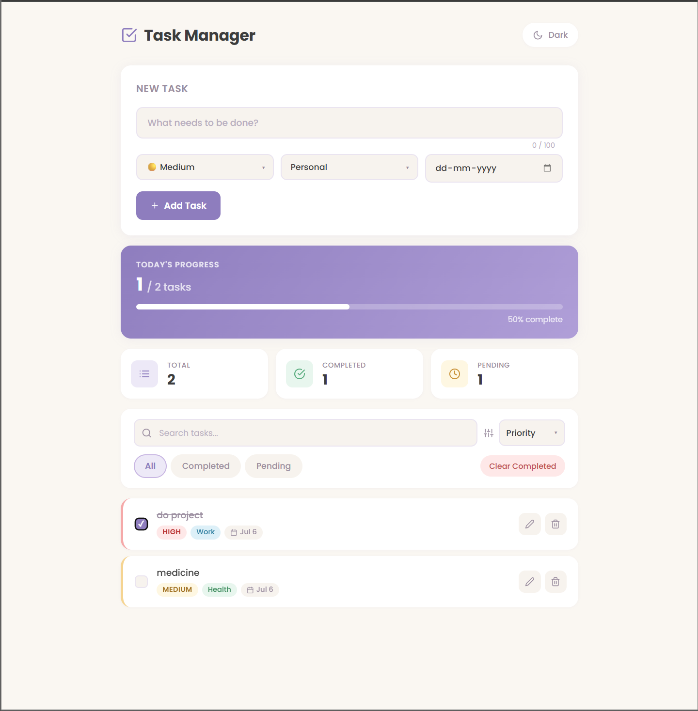

# 📝 Task Manager

A modern and responsive Task Manager application built with **React.js**. The project helps users organize daily tasks efficiently with features like task categorization, due dates, progress tracking, dark mode, and persistent storage using Local Storage.

---

## 🚀 Live Demo

🔗 **Live Application:** https://task-manager-silk-phi-27.vercel.app/

## 💻 GitHub Repository

🔗 **Repository:** https://github.com/ragyajain/task-manager-.git

---

## ✨ Features

- ✅ Create, edit, and delete tasks (CRUD)
- ✅ Mark tasks as completed
- 🔍 Search tasks instantly
- 🎯 Filter tasks (All, Pending, Completed)
- 📊 Progress tracking with statistics
- 📅 Due date support
- 🏷️ Category-based task management
- 🚩 Priority levels (Low, Medium, High)
- 🌙 Dark/Light Mode
- 💾 Local Storage persistence
- 🗑️ Delete confirmation modal
- 🔔 Toast notifications
- 📱 Responsive design for mobile, tablet, and desktop
- 🎨 Modern pastel-inspired UI with smooth animations

---

## 🛠️ Tech Stack

### Frontend

- React.js
- JavaScript (ES6)
- HTML5
- CSS3

### React Concepts Used

- Functional Components
- Props
- useState
- useEffect
- Custom Hooks
- Controlled Components
- Conditional Rendering
- Component Composition

### Browser APIs

- Local Storage

### Libraries

- React Icons
- React Toastify

---

## 📂 Project Structure

```text
src/
│
├── components/
│   ├── TaskForm.jsx
│   ├── TaskList.jsx
│   ├── TaskItem.jsx
│   ├── SearchBar.jsx
│   ├── FilterBar.jsx
│   ├── TaskCounter.jsx
│   ├── ProgressCard.jsx
│   ├── DarkModeToggle.jsx
│   ├── DeleteModal.jsx
│   └── EmptyState.jsx
│
├── hooks/
│   └── useLocalStorage.js
│
├── utils/
│   └── helpers.js
│
├── App.jsx
├── App.css
└── index.js
```

---

## ⚙️ Installation

Clone the repository:

```bash
git clone <repository-url>
```

Move into the project:

```bash
cd task-manager
```

Install dependencies:

```bash
npm install
```

Start the development server:

```bash
npm start
```

---

## 🎯 Learning Outcomes

This project demonstrates:

- React component architecture
- CRUD operations
- State management using Hooks
- Custom Hook implementation
- Local Storage integration
- Reusable component design
- Responsive UI development
- Modern UI/UX principles
- Git & GitHub workflow
- Project deployment using Vercel

---

## 🔮 Future Enhancements

- User Authentication (JWT)
- Backend Integration (Node.js + Express.js)
- MongoDB Database
- User-specific task management
- Drag & Drop task ordering
- Calendar View
- Task reminders & notifications
- Recurring tasks
- Team collaboration

---

## 📸 Screenshots



---

## 👩‍💻 Author

**Ragya Jain**

Built as a React frontend project to strengthen core React concepts, component-based architecture, and modern UI development.
